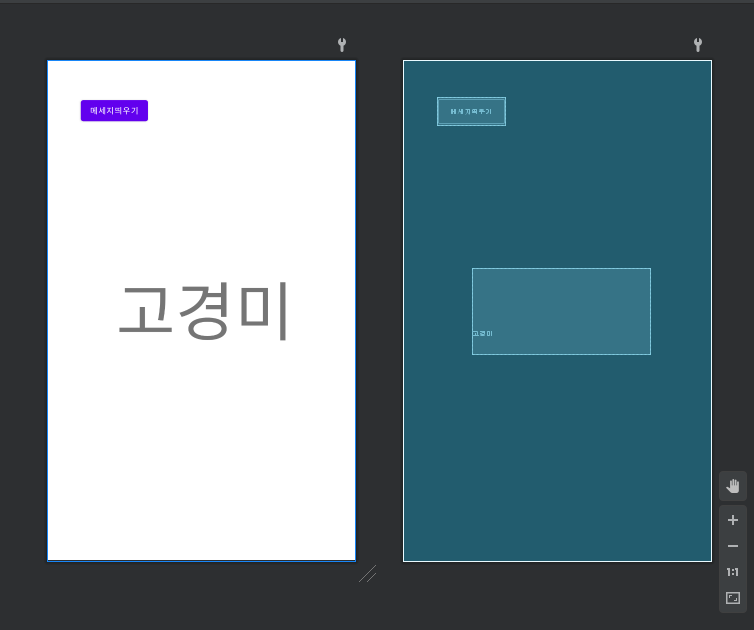
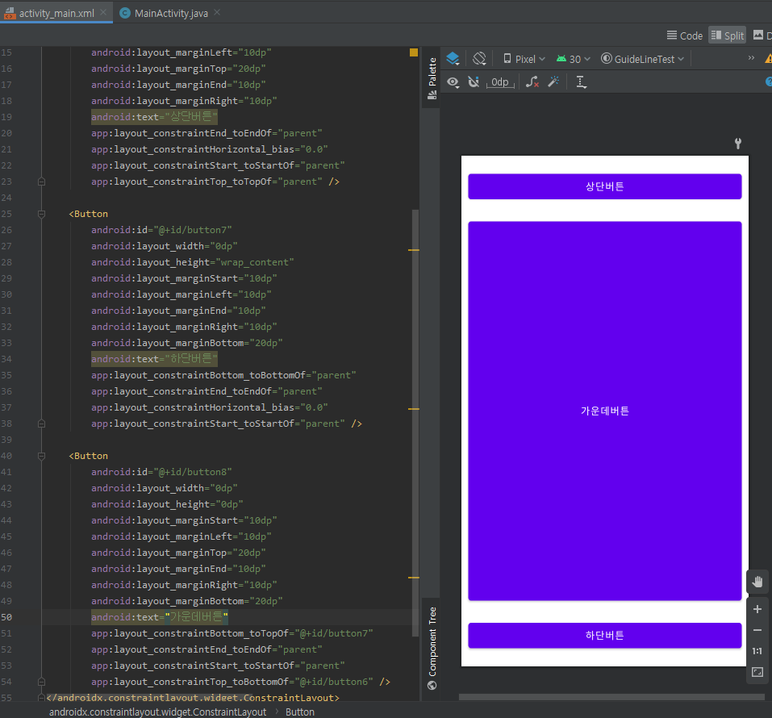

#  19173024 고경미

## 1주차 과제

## 2주차 과제
   </img>
   </img>
   
   
## 3주차 과제
   </img>
   </img>
   </img>
   
   
## 4주차 과제
  
   - 만들고 싶은 앱 : 핸드폰 갤러리에서 언제든 찾고싶은 사진을 찾을 수 있는 앱
       - 핸드폰 갤러리 속에 있는 수천장, 수만장의 사진들 중에서 막상 정말 필요로 한 사진이 있을 때 찾기가 너무 힘들어서 
       일상생활 속에서 자주 불편함을 겪는다. 그래서 수많은 사진들 중 찾아야 하는 사진을 손쉽게 찾아주는 앱이 있었으면 좋겠다.
       앱에는 사진을 검색할 수 있는 여러 카테고리가 존재한다. 날짜, 사진의 색상, 인물인지 동물/식물인지, 텍스트가 있는지 등의 카테고리가 존재하고
       더 세분화 되면 인물 검색은 그 인물 사진을 첨부하면 내 갤러리 속 그 인물의 사진이 모두 나온다. 
       
## 6주차 과제 
   </img>
   </img>
   </img>
   

## 7주차 과제
   </img>
   </img>
   
   
## 9주차 과제 

   
   
   
   

   
   

